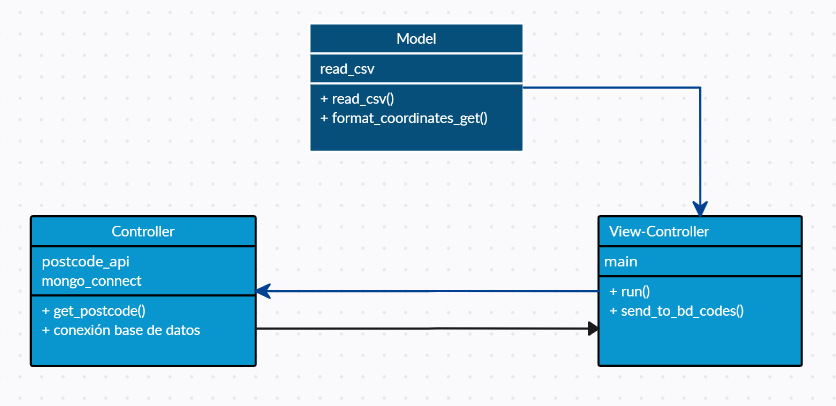

# Git Flow

El flujo de trabajo consta de 3 ramas; master, develop y feature/send_bd. 
#### feature/send_db= se realizan las nuevas funcionalidades
#### develop= se realizan pequeños cambios y correcciones
#### master= una vez funcione correctamente la funcionalidad, se suben cambios a la rama master.
El flujo de cambios es el siguiente:
Aprobar los cambios de feature/send_bd
```sh
git checkout feature/send_bd
git add .
git commit -m ""
git push origin feature/send_bd
```
Unir los cambios de feature/send_bd con la rama develop
```sh
git checkout develop
git merge feature/
```
Finalmente pasar los cambios de develop a la rama master
```sh
git checkout master
git merge develop
```

# Modelo


### Model:
read_csv.py = Lee el archivo csv con ruta contenida en una variable de entorno, realiza limpieza de datos verificando que no existan valores duplicados o nulos, así mismo valida errores dentro del archivo. Formatea la data para ser enviada como GET, retorna la data formateada para luego ser llamada desde el archivo main.py

### View-Controller:
main.py = La función run() recibe la data en forma de lista que retorna el modelo read_csv.py, por cada iteración de la lista llama a la función postcodes_api.get_postcode() pasando como parámetro cada item, dentro de la función se declara un limitador que controla las peticiones. Finalmente crea y retorna una lista con la información recibida de postcodes.api.py.
La función send_to_bd_codes() recibe la lista generada en la función run() para enviarla al endpoint “/add_postcodes” y realizar la inserción de cada item de la lista a la base de datos MongoDB.

### Controller:
Postcodes_api.py= mediante la función get_postcode() se recibe cada item enviado por la funcion run() del main.py, luego consume la API https://api.postcodes.io/postcodes? enviando por método GET cada dato (coordenadas lat y lon). Finalmente, retorna la respuesta del servicio y una lista con los códigos postales de cada coordenada, la cual es recibida por la función run() para posteriormente ser insertada a la base de datos por la función send_to_bd_codes().


# Iniciar app 

Para iniciar el proyecto es necesario ingresar en la carpeta de app y activar el ambiente virtual para después instalar los requerimientos del programa.

```sh
git clone
cd app
python3 -m venv env
source env/bin/activate
pip3 install -r requirements.txt
```

Para inciar el servidor:
```sh
cd app
uvicorn main:app --reload
```

# Iniciar con Docker
Para la construccion del contenedor, luego lanzarlo para que se cree y se inicie, luego revisar el estado, ingresar al ambiente
```sh
docker-compose build
docker-compose up -d
docker-compose ps
docker-compose exec app-csv bash
```


